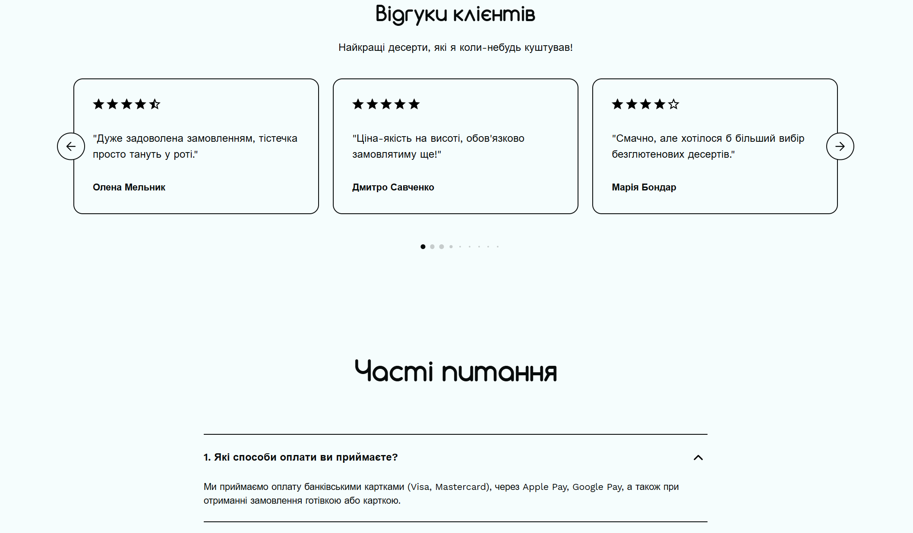
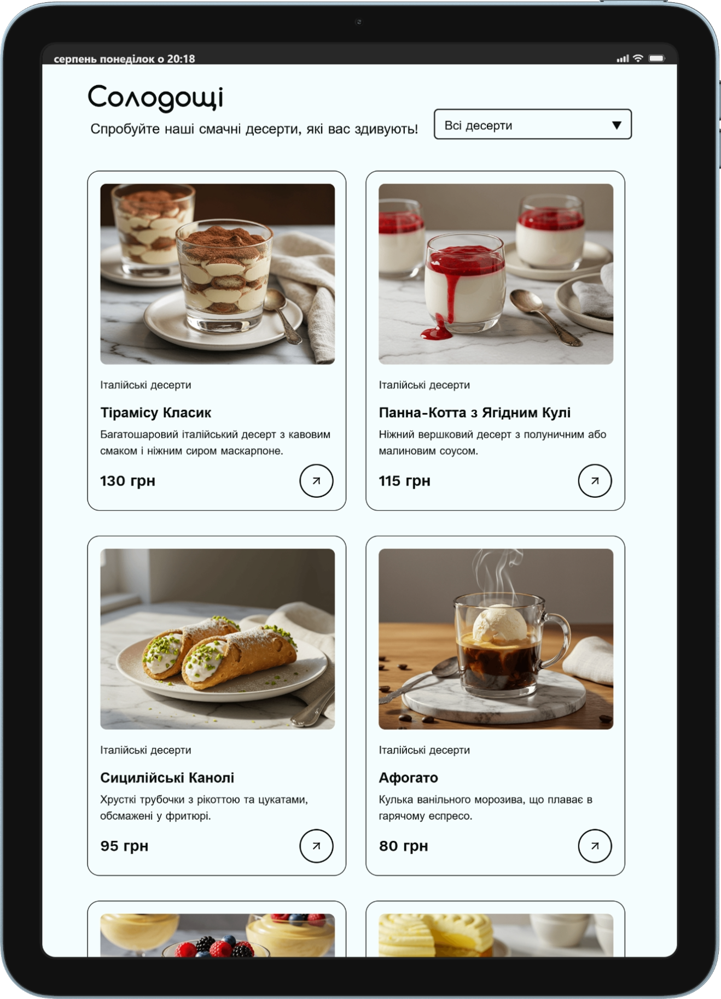
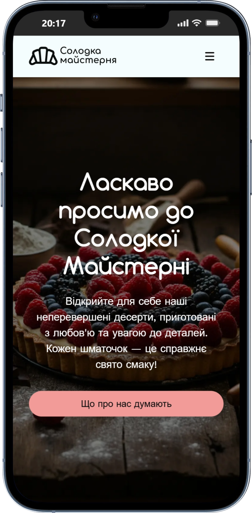

[🇺🇦 Українська](README.uk.md)

# 🍰 The Sweet Workshop

A responsive landing page for **The Sweet Workshop** — a handmade dessert brand
focused on beautiful presentation, quality ingredients, and a convenient
ordering experience.

## 📖 About the Project

**The Sweet Workshop** is a landing page created to showcase a collection of
handcrafted desserts and communicate the brand's concept and values.

The website includes a dessert catalogue, detailed information about each
dessert, customer feedback, FAQ, and an ordering flow.

## Features

- Adaptive design
- Dynamic dessert catalogue
- Dessert details modal
- Dessert ratings
- Customer feedback slider
- FAQ section
- Order modal
- Toast notifications
- Loading indicators
- Responsive navigation with burger menu
- Backend API integration

## 🛠 Technologies

### Front-end

- HTML5/CSS3
- JavaScript
- API Integration

### Libraries

- **Axios** — API requests
- **Swiper.js** — feedback slider
- **Toastify.js** — toast notifications
- **ldrs** — loading indicators
- **css-star-rating** — star ratings

### Tools

- **Vite**
- **Git / GitHub**
- **VS Code**
- **Figma**

## Project Concept

The main goal of the project is to create an attractive and appetizing online
presence for a handmade dessert brand.

The design focuses on:

- presenting the dessert assortment;
- creating an appealing and trustworthy atmosphere;
- highlighting the quality and individuality of each dessert;
- providing a simple and convenient ordering experience.

## What Problem Does It Solve?

The website provides a convenient way for customers to discover handmade
desserts in one place without needing to contact the bakery directly to learn
about available products.

It helps the brand present its products, provide detailed dessert information,
collect customer feedback, and make the ordering process simple and accessible
from any device.

## 🚀 Getting Started

Clone the repository and install the dependencies:

```bash
git clone <repository-url>
cd the-sweet-workshop
npm install
```

Start the development server:

```bash
npm run dev
```

[🔗Live Demo](https://taisiiiaaa.github.io/the-sweet-workshop/)

## Screenshots

|                   Desktop                    |                   Tablet                    |                   Mobile                    |
| :------------------------------------------: | :-----------------------------------------: | :-----------------------------------------: |
|  |  |  |

## Team Project

This project was developed collaboratively using **Git** and **GitHub**, with
team members working on different sections and features of the website.
